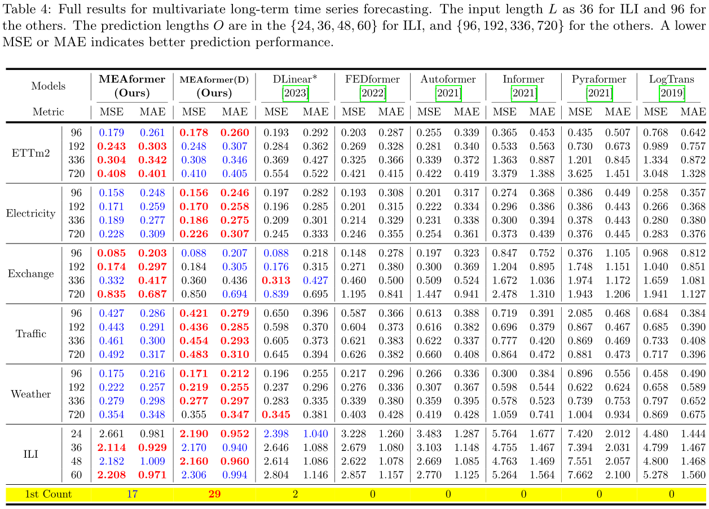

# MEAformer
MEAformer: An all-MLP Transformer with Temporal External Attention for Long-term Time Series Forecasting

This repo is the official Pytorch implementation of MEAformer: "MEAformer: An all-MLP Transformer with Temporal External Attention for Long-term Time Series Forecasting". 

### Main Results
Multivariate Forecasting:

MEAformer and decomposition-based MEAformer outperform other methods by a large margin.
## Detailed Description
We provide all experiment script files in `./scripts`:


This code is simply built on the code base of DLinear and Autoformer. We appreciate the following GitHub repos a lot for their valuable code base or datasets:

The implementation of DLinear is from https://github.com/cure-lab/LTSF-Linear


The implementation of Autoformer, Informer, and Transformer is from https://github.com/thuml/Autoformer

The implementation of FEDformer is from https://github.com/MAZiqing/FEDformer

The implementation of Pyraformer is from https://github.com/alipay/Pyraformer


## Getting Started
### Environment Requirements

First, please make sure you have installed Conda. Then, our environment can be installed by:
```
conda create -n MEAformer python=3.6.9
conda activate MEAformer
pip install -r requirements.txt
```

### Data Preparation

You can obtain all the nine benchmarks from [Google Drive](https://drive.google.com/drive/folders/1ZOYpTUa82_jCcxIdTmyr0LXQfvaM9vIy) provided in Autoformer. All the datasets are well-pre-processed and can be used easily.

```
mkdir dataset
```
**Please put them in the `./dataset` directory**

### Training Example
- In `scripts/ `, we provide the model implementation *MEAformer/MEAformer(D)/Dlinear/Autoformer/Informer/Transformer*
- In `FEDformer/scripts/`, we provide the *FEDformer* implementation
- In `Pyraformer/scripts/`, we provide the *Pyraformer* implementation

For example:

To train the **MEAformer** on **Traffic dataset**, you can use the script `scripts/EXP-LongForecasting/MEAformer/traffic.sh`:
```
sh scripts/EXP-LongForecasting/MEAformer/traffic.sh
```
It will start to train MEAformer by default, the results will be shown in `logs/LongForecasting`.


## Citing

If you find this repository useful for your work, please consider citing it as follows:

```bibtex
@article{huang2024mea,
  title={MEAformer: An all-MLP Transformer with Temporal External Attention for Long-term Time Series Forecasting},
  author={Huang, Siyuan and Liu, Yepeng, Haoyi Cui, Fan Zhang, JinJiang Li, Xiaofeng Zhang, Mingli Zhang, Caiming Zhang},
  journal={Information Sciences},
  pages={xx},
  year={2024},
  publisher={Elsevier}
}
```
```bibtex
@article{huang2024fl,
  title={FL-Net: A multi-scale cross-decomposition network with frequency external attention for long-term time series forecasting},
  author={Huang, Siyuan and Liu, Yepeng},
  journal={Knowledge-Based Systems},
  pages={111473},
  year={2024},
  publisher={Elsevier}
}
```

